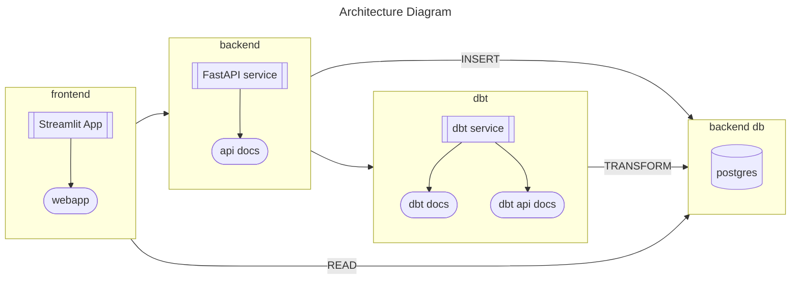

# My Finances

[](https://github.com/psf/black)
[](https://pycqa.github.io/isort/)

## Table of Contents
- [Introduction](#introduction)
- [Prerequisites](#prerequisites)
- [Configuration](#configuration)
  - [Secrets Encoding](#secrets-encoding)
  - [Database Format](#database-format)
  - [Build and Publish Images](#build-and-publish-images)
  - [Terraform Secrets](#terraform-secrets)
  - [Terraform](#terraform)
- [Deployment](#deployment)
- [Testing](#testing)

## Introduction

Welcome to My Finances repository!



## Prerequisites

Before you can deploy this project, you'll need the following:

- A Kubernetes cluster up and running. The repo has only been tested with a local k8s cluster created by Docker.
- `docker`, `terraform`, `kubectl` to deploy the project in the local cluster
- [`sops`](https://github.com/getsops/sops) and [`age`](https://github.com/FiloSottile/age) to encrypt kubernetes secrets
- GitHub Container Registry

## Configuration

### Secrets Encoding

This repo encodes its secrets with [sops with age](https://github.com/getsops/sops#encrypting-using-age). 
Update [`.sops.yaml`](terraform/.sops.yaml) with your own age recipient.

### Database Format

This repo expects the transaction data to be in the same format as the one provided by ING-DiBa.
To use it with transaction data with other format:

- Update [`init.sql`](db/init.sql) script to create the initial tables with your specific format.
- Modify [dbt source model](dbt/my_finances/models/staging/src_ing.yml) accordingly
- Modify downstream dbt models if needed

### Build and Publish images

Build and publish docker images for the api, dbt and frontend services:

```shell
cd dbt
docker build -f Dockerfile -t ghcr.io/<yourusername>/my-finances-dbt:latest .
docker push ghcr.io/<yourusername>/my-finances-dbt:latest
```

```shell
cd api
docker build -f Dockerfile -t ghcr.io/<yourusername>/my-finances-api:latest .
docker push ghcr.io/<yourusername>/my-finances-api:latest
```

```shell
cd frontend
docker build -f Dockerfile -t ghcr.io/<yourusername>/my-finances-frontend:latest .
docker push ghcr.io/<yourusername>/my-finances-frontend:latest
```

### Terraform Secrets

#### GitHub Container Registry

1. Create GitHub Personal Access Token (PAT)
2. Write secret `./terraform/secrets/dockerconfig.secret.json`:
    ```json
    {
      "username": "<GitHub Username>",
      "github_pat": "<GitHub PAT>"
    }
    ```
3. Encode file with sops:
    ```shell
    cd terraform/secrets
    sops -e dockerconfig.secret.json > dockerconfig.secret.enc.json 
    ```

#### Database Credentials

1. Create file `./terraform/secrets/db.secret.json`:
    ```json
    {
      "password": "example",
      "user": "example",
      "db": "myfinances"
    }
    ```
2. Encode file with sops:
     ```shell
    cd terraform/secrets
    sops -e db.secret.json > db.secret.enc.json 
    ```

### Terraform

1. Update kubernetes provider to match your own cluster configuration
2. Update deployments configuration:
   - Replace variable [`git_sync_git_repo`](terraform/main.tf) to match your own repo
   - Replace node name where to deploy the local storage in [`pv_node_names`](terraform/main.tf)

## Deployment

Run the following terraform commands to deploy the applications on your k8s cluster:

```shell
terraform init
terraform plan
terraform apply
```

## Testing

The project is tested with GitHub Actions. For the workflows to work on a forked repository
you need to add these GitHub secrets: 

- **Docker credentials**
  - `DOCKER_REPOSITORY`: Docker Repository where to push and pull images from (e.g. `ghcr.io` tu publish in GitHub Container Registry)
  - `DOCKER_USERNAME`: Docker username to login into the repository (e.g. `pablopardogarcia` or your GitHub username to publish in GHCR)
  - `DOCKER_PASSWORD`: Docker password to login into the repository (e.g. your GitHub Personal Access Token to publish in GHCR)
- **Postgres credentials**
  - `POSTGRES_HOST`: Postgres server host
  - `POSTGRES_USER`: Postgres user
  - `POSTGRES_PASSWORD`: Postgres password
  - `POSTGRES_DB`: Postgres database name
