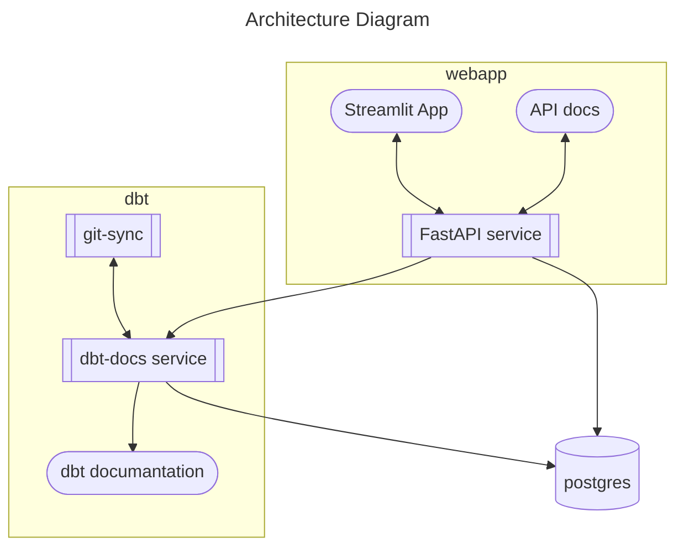

# My Finances

## Table of Contents
- [Introduction](#introduction)
- [Getting Started](#getting-started)
  - [Prerequisites](#prerequisites)
  - [Configuration](#configuration)
  - [Deployment](#deployment)

## Introduction

Welcome to My Finances repository!



## Getting Started

### Prerequisites

Before you can deploy this project, you'll need the following:

- A Kubernetes cluster up and running. The repo has only been tested with a local k8s cluster created by Docker.
- `docker`, `terraform`, `kubectl` to deploy the project in the local cluster
- [`sops`](https://github.com/getsops/sops) and [`age`](https://github.com/FiloSottile/age) to encrypt kubernetes secrets

### Configuration

1. Fork and clone this repo to your local machine:

    ```shell
   git clone https://github.com/yourusername/my-financea.git
   cd my-finances
   ```

2. Configure extract data format. Each bank formats the transactions statement slightly different.
   - Update [`init.sql`](db/init.sql) script to create the initial tables with your specific format.
   - Modify [dbt source model](dbt/my_finances/models/staging/src_ing.yml) accordingly
   - Modify downstream dbt models if needed

3. Build dbt, api and frontend docker images:

   ```shell
   cd dbt
   docker build -f Dockerfile -t my-finances-dbt .
   ```
   
    ```shell
   cd api
   docker build -f Dockerfile -t my-finances-api .
   ```
   
    ```shell
   cd frontend
   docker build -f Dockerfile -t my-finances-frontend .
   ```

4. Configure [sops with age](https://github.com/getsops/sops#encrypting-using-age). 
   Update [`.sops.yaml`](terraform/.sops.yaml) with your own age recipient
    
5. Configure terraform
   1. Update kubernetes provider to match your own cluster configuration
   2. Update deployments configuration:
      - Replace variable [`git_sync_git_repo`](terraform/main.tf) to match your own repo
      - Replace node name where to deploy the local storage in [`pv_node_names`](terraform/modules/my_finances/main.tf)
      - Update modules `my-finances` and `lightdash` to match your needs

### Deployment

Run the following terraform commands to deploy the applications on your k8s cluster:

```shell
terraform init
terraform plan
terraform apply
```

### Test

The project is tests with GitHub Actions. For the workflows to work on a forked repository
you need to add these GitHub secrets: 

- **Docker credentials**
  - `DOCKER_REPOSITORY`: Docker Repository where to push and pull images from (e.g. `ghcr.io` tu publish in GitHub Container Registry (GHCR))
  - `DOCKER_USERNAME`: Docker username to login into the repository (e.g. `pablopardogarcia` or your GitHub username to publish in GHCR)
  - `DOCKER_PASSWORD`: Docker password to login into the repository (e.g. your GitHub Personal Access Token to publish in GHRC)
- **Postgres credentials**
  - `POSTGRES_HOST`: Postgres server host
  - `POSTGRES_USER`: Postgres user
  - `POSTGRES_PASSWORD`: Postgres password
  - `POSTGRES_DB`: Postgres database name
